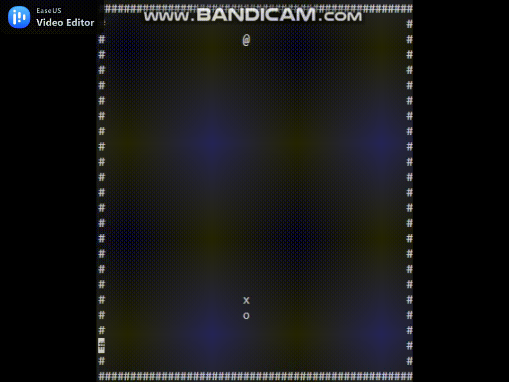

# neverDie snakeGame C++
Build up your legendary snakeGame on C++ and console command.
The Snake nerver dies ^^

  
------
*original tutorial : https://www.youtube.com/watch?v=AxrQje7V65o

##support OS
>windows terminal : yes  
>ubuntu : no, next release will be  
>compiled with g++8

##good thing
>no flickering issues in the playground, which is usually seen at many console command-based games  
>the Snake never dies :)) still in the next release would have an option if it is mortal  
>no score, let's relax !  

# control 
	[x] a s d w or arrow keys to move, caplock work also  
	[x] space to pause  
	[x] enter to reset  
	[x] ESC to quit  

# course for C++
can take any, it's not simple as Python or Java but let's get dirty hand to learn  
recommended : https://ascend.udemy.com/course/beginning-c-plus-plus-programming/learn/lecture/27255988#announcements  

